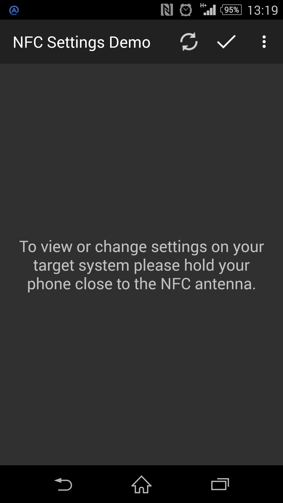
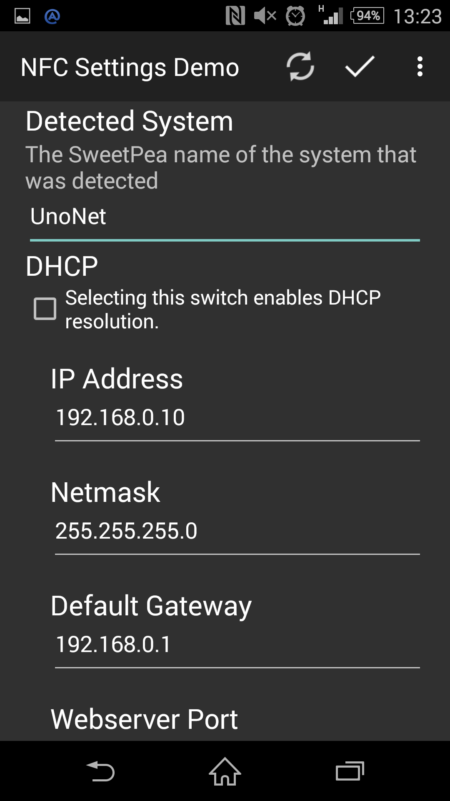

SweetPea NFC Settings Demo
===================================

This example app shows you how to make use of the Android Nfc framework in
order to create an application that can read and write data to and from a
an ST M24SR02 Dual port EEPROM.

This example was targeted to the SweetPea UnoNet+ product to provide the
user with a accessable and easy way to configure network parameters on the
UnoNet+ board without having to have any other user interface.

Screenshots
-------------

  

Getting Started
---------------

Yet to come

Support
-------

Yet to come.

License
-------

Yet to come.
